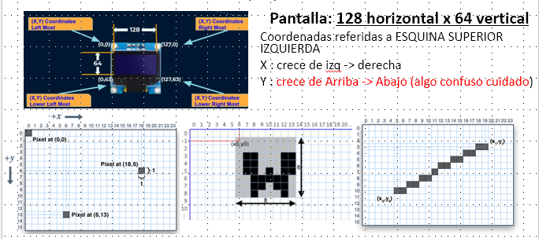
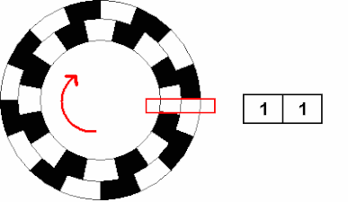
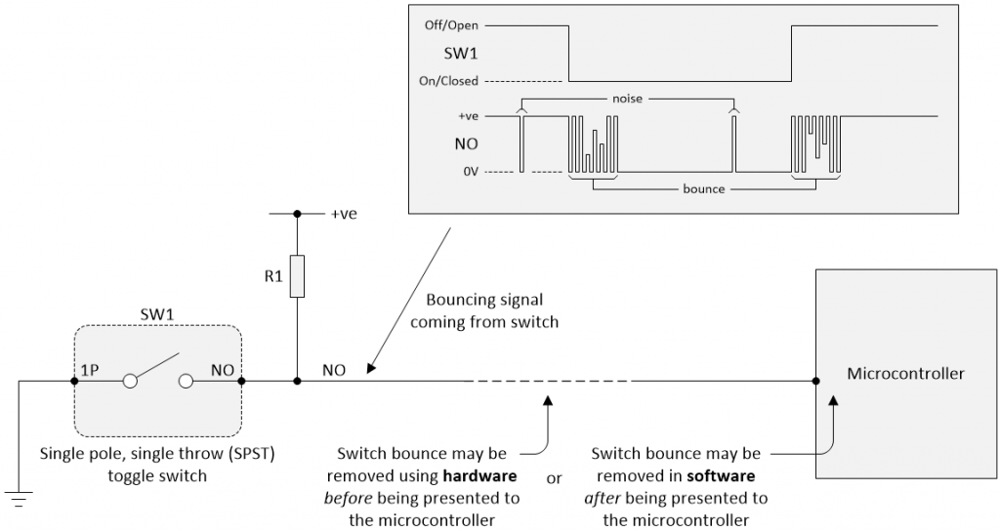
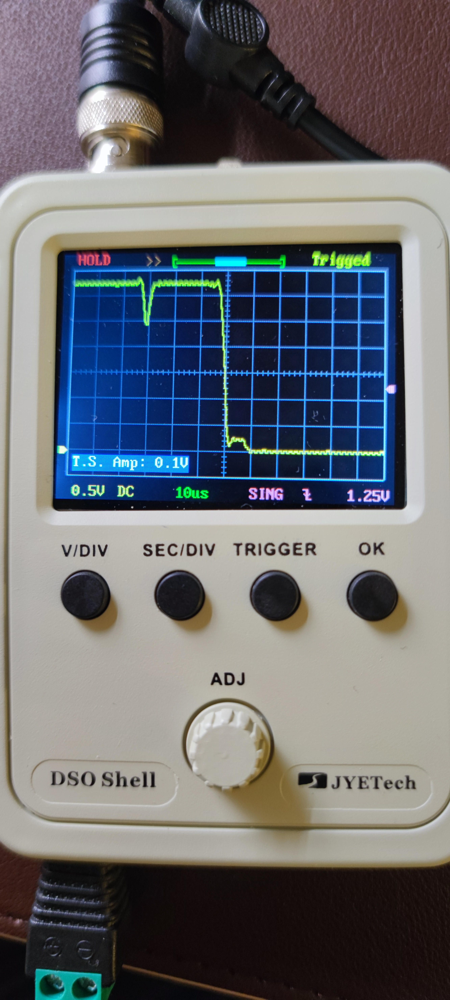
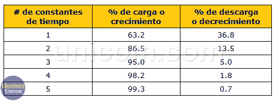

# CL10 - uPython : Display Grafico mono 128x64 SH1106+RE+3sw : 1eros pasos (no GUI) - PyR 2024_25 CMM BML


Forma parte de la serie '**Workshop about Python and micropython with Pico W in CMM Benito**' Martin Madrid. 

Esta clase es más el reflejo de una investigación que un resultado cerrado.

<u>Nota Importante : este estudio **usara librerías básicas** y no librerías GUI</u> (Graphic User Interface) como   [nano-gui widget library](https://github.com/peterhinch/micropython-nano-gui), (que incluyen este modelo de display entre los que son capaces de manejar) y [micro-gui: A lightweight MicroPython GUI library for display drivers which allows input via pushbuttons](https://github.com/peterhinch/micropython-micro-gui). El estudio de librerías con GUI, crea diseños elegantes para los proyectos complejos, diríamos que son diseños profesionales y minimiza la programación. Pero :

1. Añadir capas y capas de abstracción, hace que se pierda el contacto con el HW; 

2. Incluye además programación asíncrona que es compleja

3. La puesta en marcha y carga de las librerías es compleja y no exenta de problemas ( propia experiencia), etc.

Llegaremos a estudiar las librerías de display con GUI, pero en una clase posterior, y cuando se haya practicado con guizero o pygame

## 2024-2025 Clase 10 - Indice - xx minutos

- Antes de comprar

- Plantearse objetivos iniciales

- Info previa: Tutoriales, Librerías, Conexionado y Programas que vamos a seguir

- Estudio del SH1106 + RE + 3pulsadores con Pico & escribir BHWT
  
  1. Estudio del display + escribir programas básicos de test (BHWT)
  
  2. Letras con tamaños distintos + escribir programas básicos de test (BHWT)
  
  3. Estudio de Rotary Encoder (RE) + escribir programas básicos de test (BHWT)
  
  4. Check de Pulsadores + recuperar/adaptar programas básicos de test (BHWT)

- Avanzado - Circuitos RC para evitar rebotes en pulsadores 

- Preguntas
  
  --------------------

## Antes de comprar

#### Para que

Cuando compramos HW nuevo en robotica hay que preguntarse ¿para que?, porque a veces nos puede mas el deseo que la realidad del tiempo de que disponemos. De todas forma los componente no suelen ser caros, en este caso unos 5 euros en aliexpres (abril 2025)

**Caso SH1106 =>** para proyectos en los que queramos tener **texto + gráficos sin color**

1. Es el display gráfico más sencillo posible junto al SSD1306

2. las 1.3 pulgadas lo hacen mas útil que el SSD1306 (que es muy popular, pero demasiado pequeño) para incorporar a proyectos en los que queramos tener gráficos o logos etc.

3. Incluye 3 pulsadores y un Rotary Encoder, que son suficientes para disponer de entradas de control en nuestro proyecto

#### Comprobar la disponibilidad de librerías y Tutoriales

Ver abajo, **conclusión: hay suficientes librerías y estan bien documentadas**

### Plantearse objetivos iniciales

Hay 3 tipos de hw a considerar en este producto, luego habrá 3 objetivos 1 x cada hw. Adicionalmente con el display exploraremos mas tipos de letras:

1. Display : clonar todos los BHWT de ssd1306

2. RE : funcionamiento básico del Rotary Encoder con libreria

3. Pulsadores : probar con interrupciones

4. Display objetivo adicional : Letras con tamaños y fuentes distintas libreria writer

## Info. previa : Conocimientos previos/ a adquirir,  Tutoriales, Librerías y Conexionado

### Link a aliexpres para compra

[SH1106 1.3 pulgadas monocromo I2c](https://es.aliexpress.com/item/1005007728845587.html?spm=a2g0o.order_list.order_list_main.23.1f16194dbIkIVd&gatewayAdapt=glo2esp)

### Conocimientos mínimos o a adquirir

#### <u>Display</u>

- Protocolo I2C básico ( adquirido ya con LCD) 

- Coordenadas de la pantalla en framebuffer

- Pizarra framebuffer : es una copia en la que se hacen los dibujos y luego se copian a la pantalla física.

##### Tutoriales resumen Display SH1106

**En realidad me he seguido a mi mismo adaptando mi  clase del SSD1306 CL23 – 22Nov.-13Dic 2023** [link a pdf](https://github.com/Jcspoza/CMM_Python_uP_PicoW/blob/main/CL23_OLED_ssd1306/CMM_BML_Taller_P_R2023_CL23_nl.pdf)

Algunos tutos:

El mejor que he encontrado , pero es para ESP32 aunque creo que el codigo debería valer en su mayor parte 

[011 - MicroPython TechNotes: 1.3 OLED Display | TechToTinker](https://techtotinker.com/2021/02/10/011-micropython-technotes-1-3-oled-display/)

Otros con el uC Pico

No esta mal : [Using various SSD1306 and SH1106 128x64 OLED displays on a RaspberryPi Pico with micropython - YouTube](https://youtu.be/3TYohlerwaY?si=TxRBgxzFvRkL3fF4)

No es gran cosa : [Raspberry Pi Pico/MicroPython exercise using SH1106 I2C OLED](https://coxxect.blogspot.com/2022/08/raspberry-pi-picomicropython-exercise.html), usa una versión antigua de la libreria. SIEMPRE id a buscar al origen las librerías, si es posible

#### <u>Rotary encoder</u>

**Conviene ver un tutorial de la mecánica de un RE**, vale cualquiera de los tutoriales hechos para arduino, como este

[Rotary Encoders – Prometec](https://www.prometec.net/rotary-encoders/) (no seguir desde el codigo arduino )

o este en ingles

[Rotary Encoder - Learning MicroPython](https://dmccreary.github.io/learning-micropython/sensors/10-rotary-encoder/)

#### <u>Pulsadores</u>

- Entender la parte mecánica de pulsadores de
  
  - 2 patas
  
  - 4 patas : que es que que viene en el kit, pero funciona como el de 2 patas duplicado
  
  - 3 patas con NO ( normally open) y NC (normally closed)

- Entender el problema de los rebotes ( ver al final de la clase)

- Interrupciones : qué son y porque se usan con los pulsadores ( y otros componentes que requieren respuesta inmediata)

### Librerías resumen y detalle

| Link a módulos                         | Link Github                                                                                                                                                                         | Notas - tutoriales                                                        | Libreria       |
| -------------------------------------- | ----------------------------------------------------------------------------------------------------------------------------------------------------------------------------------- | ------------------------------------------------------------------------- | -------------- |
| [sh1106.py](sh1106.py)                 | [GitHub - robert-hh/SH1106: MicroPython driver for the SH1106 OLED controller](https://github.com/robert-hh/SH1106)                                                                 |                                                                           | Display SH1106 |
| [writer.py](writer.py)                 | [micropython-font-to-py/writer/WRITER.md at master · peterhinch/micropython-font-to-py · GitHub](https://github.com/peterhinch/micropython-font-to-py/blob/master/writer/WRITER.md) | Programa principal de la libreria para escribir con varios tipos de letra | Writer         |
| [freesans20.py](freesans20.py)         |                                                                                                                                                                                     | Fuente de letra tamaño 20 para usar con writer                            | Writer         |
| [inkfree20.py](inkfree20.py)           |                                                                                                                                                                                     | Fuente de letra tamaño 20 para usar con writer. Generada por mi           | Writer         |
| [rotary.py](rotary.py)                 | [@MikeTeachman  micropython-rotary](https://github.com/MikeTeachman/micropython-rotary)                                                                                             | Fichero core , independiente del uC                                       | Rotary Encoder |
| [rotary_irq_rp2.py](rotary_irq_rp2.py) | [@MikeTeachman  micropython-rotary](https://github.com/MikeTeachman/micropython-rotary)                                                                                             | Fichero complementario dependiente del uC                                 | Rotary Encoder |

...

#### Display sh1106 - librería básica

Parece ser la única que hay , junto la la de  [nano-gui widget library](https://github.com/peterhinch/micropython-nano-gui)

[GitHub - robert-hh/SH1106: MicroPython driver for the SH1106 OLED controller](https://github.com/robert-hh/SH1106)

Copyright (c) :

- 2016 Radomir Dopieralski (@deshipu),

- 2017-2021 Robert Hammelrath (@robert-hh)

- 2021 Tim Weber (@scy)

#### Display writer - Libreria para ampliar fuentes

La libreria del display al basarse en framebuffer (explicación larga), solo maneja fuentes de 8x8. Para usar otras fuentes emplearemos la libreria writer, que esta dentro de :

 [micropython-font-to-py/writer/WRITER.md at master · peterhinch/micropython-font-to-py · GitHub](https://github.com/peterhinch/micropython-font-to-py/blob/master/writer/WRITER.md), 

que aunque diseñada para los GUI mencionados anteriormente, se puede usar sola.

#### Rotary Encoder - Libreria básica

Esta muy bien documentada en el readme de la libreria en github, en cuanto a como usar la libreria.

[GitHub - miketeachman/micropython-rotary: MicroPython module to read a rotary encoder.](https://github.com/MikeTeachman/micropython-rotary)

----

### Conexiones usadas en los programas - Configuración : i2c4_5


* <u>Alimentación</u>

    VCC -> +3,3volt  de la pico 

    GNN -> GND de la Pico

- <u>Display SH1106 I2C</u>

    I2C en GPIO 4&5 = SDA0 & SCL0 a 400khz

El circuito se muestra abajo:

* Tiene un reset por circuito RC, con lo que no hay que 'gastar' ningún pin para el reset.

* El I2c va con pull-ups de 10K


- <u>Rotary encoder</u>

De nuevo va con pull -ups y además incluye un circuito RC para alisar los rebotes


    TRA en **GPIO16**

    TRB en **GPIO 17**

Nota : si al probar con la libreria de Rotary Encoder un programa que, por ejemplo dé numero que se incrementa al girar el RE, pero vemos que el numero se decrementan ==> hay que cambiar el orden de las conexiones TRA y TRB

- <u>3 switchs </u>
  
  No hay información del circuito de los pulsadores  Confirm y Back, pero hay que suponer que incluyen circuitos de pull-ups y de anti-rebotes similares al del pulsador Push
  
  Confirm en GPIO18
  
  Back en GPIO19
  
  Push ( del Rotary encoder) en GPIO20

```
CONFIRM = 18
BACK = 19
PUSH = 20
confPul = Pin(CONFIRM, Pin.IN) # pull up por circuito
backPul = Pin(BACK, Pin.IN) # pull up por circuito
pushPul = Pin(PUSH, Pin.IN) # pull up por circuito
```

### Tabla resumen de programas ejemplos o Basic HW Test

| Programa - en uPython                                              | Configuración HW                                 | Objetivo del basic HW test                                                  |
| ------------------------------------------------------------------ | ------------------------------------------------ | --------------------------------------------------------------------------- |
| [Rbhwt_I2Cscan.py](Rbhwt_I2Cscan.py)                               | I2C en GPIO 4&5 = SDA0 & SCL0 a 400khz := i2c4_5 | Check de que el bus I2c esta ok, la dirección debe ser la 60, o en hex 0x3c |
| [Rbhwt_sh1106_1_0.py](Rbhwt_sh1106_1_0.py)                         | i2c4_5                                           | Test T1: muestra un texto y un cuadrado                                     |
| [Rbhwt_sh1106_writer_1_0.py](Rbhwt_sh1106_writer_1_0.py)           | i2c4_5                                           | Test # 1 de la libreria writer con freesans20 o inkfree20                   |
| [Rbhwt_sh1106_showGraph_1_0.py](Rbhwt_sh1106_showGraph_1_0.py)     | i2c4_5                                           | Muestra un show de comandos gráficos de framebuffer                         |
| [Rbhwt_sh1106RE3sw_Test3sw1_0.py](Rbhwt_sh1106RE3sw_Test3sw1_0.py) | CONFIRM = GPIO18 / BACK = GPIO19 / PUSH = GPIO20 | Test de los 3 pulsadores usando interrupciones. NO usa el display           |
| [Rbhwt_sh1106RE3sw_RE1_0.py](Rbhwt_sh1106RE3sw_RE1_0.py)           | TRA = GPIO16 / TRB = GPIO17                      | Test #1 Rotary Encoder con libreria.                                        |
| **Programas secundarios**                                          | ----------                                       | --------------                                                              |
| [Rbhwt_RE0_0.py](Rbhwt_RE0_0.py)                                   | R. Encoder GPIO16 & 17                           | T_RE_0 : super básico de RE, se observa la secuencia de bits al girar       |
| renc_lib_simple_limit.py                                           | R. Encoder GPIO16 & 17                           | Tre3: libreria con limites de incremento                                    |
| renc_lib_simple_nolimit.py                                         | R. Encoder GPIO16 & 17                           | Tre4: libreria sin limites                                                  |

 ...

## Recomendaciones de estudio despues de la clase

Tutoriales ya indicados

------

## Estudio de SH1106+RE+3sw

### 1. Estudio del display y elaboración de programas básicos de test  BHWT

#### 1.1 Test del I2c => el uC 've' el display

[Rbhwt_I2Cscan.py](Rbhwt_I2Cscan.py)

Con un montaje Hw nuevo conviene siempre empezar comprobando que lo básico funciona. En el caso del display lo que ha de funcionar es el bus I2C es decir que el microcontrolador ***vea*** el display.

El programa de test I2c lo hemos usado más de una vez asi que hay poco que comentar. Veamos el resultado

```
uPython version: v1.25.0-preview.73.g406bccc75 on 2024-12-03 (GNU 13.2.0 MinSizeRel) 
uC: Raspberry Pi Pico2 with RP2350 - Key other HW: I2C en GPIO 4&5 = SDA0 & SCL0 400khz
Program: Test HW basico Scan bus i2c - Version: 1.0
Key Library: Nothing
I2C(0, freq=400000, scl=5, sda=4, timeout=50000)
Scanning I2C bus.
1 devices found.
Decimal address: 60 , Hex address:  0x3c
```

#### 1.2.Test básico SH1106

[Rbhwt_sh1106_1_0.py](Rbhwt_sh1106_1_0.py)

El objetivo es tener un programa que muestre en el display un texto y una figura geométrica para estar seguros, no solo de que el bus I2C del display funciona, sino que funciona el propio display.

Veamos como se inicializa el display , como se le ordena la escritura de textos y el dibujo del cuadrado

```
    # 1- Creacion del objeto display
    display = sh1106.SH1106_I2C(WIDTH,
                                HEIGHT,
                                i2c,
                                res = None,
                                addr = 0x3c,
                                rotate = 0) # valores 0, 90, 180, 270
    # 2 inicializacion
    display.sleep(False)
    display.fill(0)
    # 3. escribir text
    display.text('Test JCSP 07mr25', 0, 0, 1)
    # 4. dibujar cuadrado
    display.rect(WIDTH//4 - 10, HEIGHT//2 - 8, 20, 16, 1) # x0, y0, size hor, size vert , color
    # 5 mostrar los ultimos cambios
    display.show()
```

1) En la creación del objeto se pasan los parámetros de:
- anchura y altura del display, 

- el objeto bus i2c recién creado, 

- que el display usado no tiene pin de reset ( ver al final información sobre este tema avanzado)

- la dirección i2c (cuidado si el bus se comparte) 

- la rotación a 0º. Las rotaciones a 90º y 270º son problemáticas. mejor usar el display en apaisado
2. Inicialización
   
   sleep a False activa el display
   
   fill(0) : es decirle al display que llene todo el display del color etiquetado como '0' es decir no color
   
   fill(1) indicaría todo el display en blanco

3. Escribir texto
   
   `display.text('Test JCSP 07mr25', 0, 0, 1)`
   
   las coordenadas se cuentan desde la esquina superior izquierda como 0,0
   
   

4. El color 1, corresponde a 'iluminar led' = blanco

5. Dibujar cuadrado
   
   `display.rect(WIDTH//4 - 10, HEIGHT//2 - 8, 20, 16, 1)`
   
   Los parámetros para dibujar cuadrado son x0, y0, size hor, size vert , color
   
   HEIGHT//2 es división entera de la altura del display , es decir 32 en este caso

6. Mostrar los últimos cambios
   
   `display.show()`
   
   El display al estar basado en framebuffer ( concretamente de `framebuf.FrameBuffer` ) , no ejecuta los cambios directamente, sino que  tiene una memoria copia de la pantalla, que es donde se hacen los cambios y con show() se vuelcan

Una vez ejecutado este test básico como el objeto display se queda 'vivo' se pueden probar otros métodos de dibujo y de texto en el display. Recordar que siempre hay que acabar con `display.show()` para mostrar los últimos cambios.

A continuación unos ejemplos de comandos a ejecutar en REPL

```
# The following codes should be tested using the REPL.
# #1. To print a string:  
# display.text('Hello world', 0, 0)
# #2. To display all the commands in queue:     
# display.show() 
# #3. Now to clear the oled display:  
# display.fill(0) 
# display.show() 
# #4. You may also use the invert function to invert the display.  
# display.invert(1) 
# #5.To display a single pixel.  
# display.pixel(10,20,1) 
# display.show() 
# #6. To display a horizontal line  
# display.hline(30,40,10,1) 
# display.show() 
# #7. To display a vertical line  
# display.vline(30,45,5,1) 
# display.show() 
# #8. While hline and vline is quite useful, there is another function that is more flexible to use which is the line function.  
# display.line(0,50,10,50,1) 
# display.show() 
# #9.We may also be able to print a rectangle.  
# display.rect(10,60,10,5,1) 
# display.show() 
# #10. Or we may also print a filled rectangle:  
# display.fill_rect(10,70,10,5,1) 
# display.show()
```

#### 1.3.Test gráfico completo de  SH1106

[Rbhwt_sh1106_showGraph_1_0.py](Rbhwt_sh1106_showGraph_1_0.py)

El objetivo es tener un programa que muestre en el display casi todos los gráficos posibles. En realidad los métodos para dibujar gráficos son herencia de la libreria Framebuffer.

El programa, despues de un mensaje de introducción, muestra en forma de carrusel una serie de figuras graficas  posibles y vuelve a empezar. A destacar un 'truco' de python en MENU, que guarda las funciones a ejecutar, diseñadas para mostrar rectángulos, triángulos etc.

`orden = MENU[opcion]` almacena la función a ejecutar en orden

`msgL8 = orden()` ejecuta la función almacenada en orden y recoge el mensaje de esa función

```
MENU = [show_rect,
        show_circ,
        show_ellipse,
        show_triangle,
        show_pentagono,
        show_Frect,
        show_QFellipse,
        show_invert,
        show_normal]
.......
try:
    while True:
        oledsh.fill(0)
        oledsh.text("Test de graficos",0,0,1)
        oledsh.show()
        for opcion in range(len(MENU)):
            orden = MENU[opcion]
            msgL8 = orden()
```

**NOTA : no se han incluido por no alargar la clase, otros programas BHWT clonados de la clase 23 del display SSD1306, como ver una imagen, pero se ha hecho en su mayoría**

### 2. Letras con tamaños distintos

El inconveniente de las librerías de display grafico basadas en frambuffer, es que solo cuentan , de forma nativa, con 1 tipo de letra de 8x8. Para ampliar los tipos de letras existe la libreria writer, que esta dentro de :

[micropython-font-to-py/writer/WRITER.md at master · peterhinch/micropython-font-to-py · GitHub](https://github.com/peterhinch/micropython-font-to-py/blob/master/writer/WRITER.md)

que aunque diseñada para los GUI mencionados al principio de esa lección, se puede usar sola.

El programa font to py es capaz de convertir fuentes residiendo en el sistema operativo windows del PC, a fuentes 'usables' con displays. Yo lo he probado con la fuente 'inkfree' con resultados OK. El github tiene amplia documentación. 

He hecho un ejemplo en 

[Rbhwt_sh1106_writer_1_0.py](Rbhwt_sh1106_writer_1_0.py)

IMPORTANTE : hay que copiar la libreria writer.py al PICO y también el fichero de la fuente que queramos usar.

---------

### 3. Estudio de RE

Consultar los tutoriales

**Conviene ver un tutorial de la mecánica de un RE**, vale cualquiera de los tutoriales hechos para arduino, como este

[Rotary Encoders – Prometec](https://www.prometec.net/rotary-encoders/) (no seguir desde el codigo arduino )

o este en ingles

[Rotary Encoder - Learning MicroPython](https://dmccreary.github.io/learning-micropython/sensors/10-rotary-encoder/)

En realidad el funcionamiento de un RE es muy sencillo, y se puede ver en este gif:

Los pines TRA y TRB se conectan como una aguja de tocadiscos sobre los discos interior y exterior del dibujo, y estan con pull-up

Cuando tocan la zona negra se conectan a GND, es decir 'blanco' 'blanco' = '00'

Al estar las zonas negras decaladas la secuencia de cambio desde '11' indica el sentido del giro



Esto se puede ver con el programa de test#0 

[Rbhwt_RE0_0.py](Rbhwt_RE0_0.py)

```
Fin de la inicializacion.
Gira el RE y veras cambiar la secuencia de los valores de los pines
Si giras a derecha la secuencia tene el orden inverso de girar a al izquierda
Secuencia de giro a la derecha : 11 -> 01 -> 00 -> 10 -> 11
Secuencia de giro a la izquierda : 11 -> 10 -> 00 -> 01 -> 11
[gire en sentido horario]
11
01
00
10
[gire en sentido anti-horario]
11
10
00
01

11
```

Pero este programa es poco útil, porque hay que incluir  :

* Evitación de rebotes

* Interrupciones para manejar los cambios de los pines de RE

Eso ya lo ha hecho la libreria de [Mike Teachman](https://github.com/miketeachman)

Libreria : [@MikeTeachman  micropython-rotary](https://github.com/MikeTeachman/micropython-rotary)

#### 3.1 RE BHWT Test #1 con libreria

[Rbhwt_sh1106RE3sw_RE1_0.py](Rbhwt_sh1106RE3sw_RE1_0.py)

### 4. Check de Pulsadores ==> PENDIENTE ESCRIBIR

------

## Avanzado - Circuitos RC para evitar rebotes en pulsadores

Tutorial base ( el mejor que he encontrado pero en ingles)

[ultimate-guide-to-switch-debounce](https://www.eejournal.com/article/ultimate-guide-to-switch-debounce-part-3/)

### Visualización del problema

Los rebotes (bounce en ingles) pueden hacer que **el uControlador interprete mas de 1 pulsación**



Créditos: Imagen propiedad del articulo escrito por Max Maxfield

Fotos reales hechas por mi

|  |  |
| ---------------------------------------------------------------------- | --------------------------------------------------------------------- |

### Solución HW : Circuito usado en el display SH1106+Re+3 pulsadores

Este es el circuito usado en los 3 pulsadores que tiene el display:

NO CONSIDERAR la resistencia de 100ohm no cuenta, es solo una protección para las entradas del uC, que limita la corriente.

**El circuito anti-rebotes usado No es el ideal, pero funciona bien en la bajada.**

Según el articulo del tutorial  los picos son de 1.5us de media y con máximo de 6.6 us, por lo que los 'alisaria' razonablemente, porque el circuito de carga tiene un RC 1000 veces mayor, y no daría tiempo a cargarse antes de la siguiente puesta a tierra, en el siguiente rebote a '0'. 

Dicho de otro modo como el circuito esta diseñado para que sea el '0' el que marque una pulsación al uC. El circuito baja rápido a '0' en aproximadamente 1 a 2 usec, pero sube lento como para confundirse con un '1', si se da un rebote hacia arriba

Cálculos de un rebote hacia a arriba despues de pulsar

    el nivel minimo de '1' ha de ser 2volt en la lógica 3,3 CMOS => 2volt/3.3 volt = 60%

    en 1 RC el circuito de carga llega hasta el 63% ~~ 2 volt

    Un rebote hacia arriba necesitaría durar un 1ms




## Preguntas sobre la Clase 9 - 10 minutos

Sección para que los alumnos pregunten sus dudas durante la clase

---
