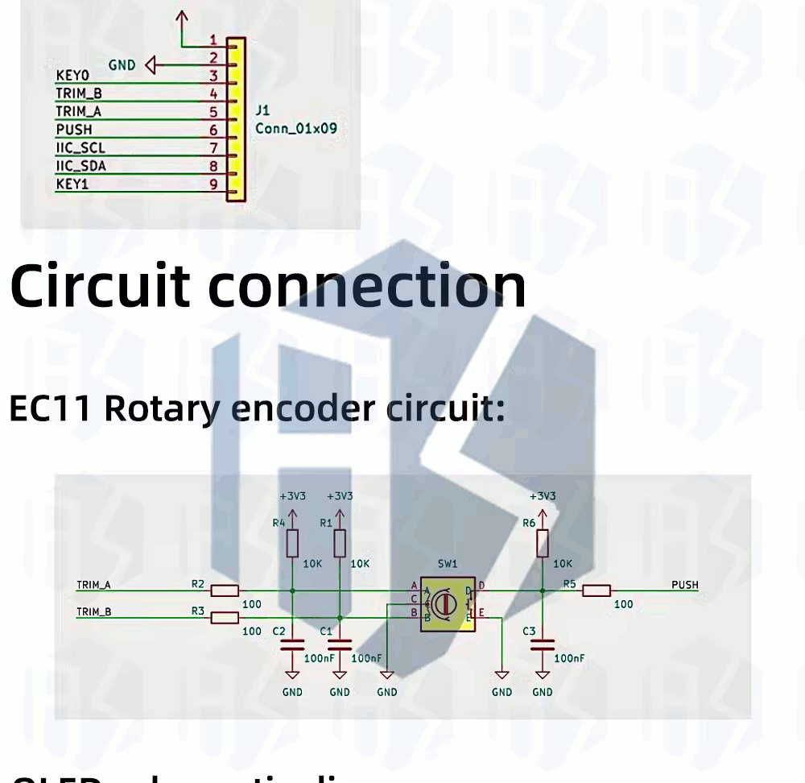

# CL9 - uPython : Display Grafico mono 128x64 SH1106+RE+3sw : 1eros pasos - PyR 2024_25 CMM BML


Forma parte de la serie '**Workshop about Python and micropython with Pico W in CMM Benito**' Martin Madrid

## Clase 10 - Indice - 90 minutos

- Intro

- 2

## Tutoriales y Programas que vamos a seguir

### Tutoriales resumen

----

### Conexiones - Config : i2c4_5



- <u>Alimentacion</u>
  
  VCC -> +3,3volt  de la pico 
  
  GNN -> GND de la Pico

- <u>Display SH1106 I2C</u>

    I2C en GPIO 4&5 = SDA0 & SCL0 a 400khz

- <u>Rotary encoder</u>

    TRA en GPIO16

    TRB en GPIO 17

- <u>3 switchs </u>
  
  Confirm en GPIO18
  
  Back en GPIO19
  
  Push ( del Rotary encoder) en GPIO20

```
CONFIRM = 18
BACK = 19
PUSH = 20
confPul = Pin(CONFIRM, Pin.IN) # pull up por circuito
backPul = Pin(BACK, Pin.IN) # pull up por circuito
pushPul = Pin(PUSH, Pin.IN) # pull up por circuito
```

### Tabla resumen de programas

| Programa - en uPython                | Configuración HW                       | Objetivo del basic HW test                                   |
| ------------------------------------ | -------------------------------------- | ------------------------------------------------------------ |
| [Rbhwt_I2Cscan.py](Rbhwt_I2Cscan.py) | I2C en GPIO 4&5 = SDA0 & SCL0 a 400khz | Check de que el bus I2c esta ok, la dirección debe ser la 60 |
|                                      |                                        |                                                              |
|                                      |                                        |                                                              |
|                                      |                                        |                                                              |
|                                      |                                        |                                                              |

### Recomendaciones de estudio despues de la clase

s

## Intro: ¿Cómo abordar el estudio y uso de nuevo HW? Caso SH1106+RE+3sw

### Antes de comprar

#### Para que

Cuando compramos HW nuevo en robotica hay que preguntarse ¿para que?, porque a veces nos puede mas el deseo que la realidad del tiempo de que disponemos. De todas forma los componente no suelen ser caros, asi que el no comprar debe estar motiva mas en que no nos cuadre en lo que querremos experimentar o estudiar en un futuro cercano.

**Caso SH1106 =>**

1. Estudiar el display gráfico más sencillo posible

2. las 1.3 pulgadas lo hacen mas útil que el SSD1306 (que es muy popular, pero demasiado pequeño) para incorporar a proyectos en los que queramos tener gráficos o logos etc.

#### Disponibilidad de librerías y Tutoriales

## 

## Avanzado - Circuitos RC para evitar rebotes


https://www.eejournal.com/article/ultimate-guide-to-switch-debounce-part-2/

RC de bajada es = 100 ohm * 100nF = 10 us =>> a los 10usec el voltaje en condensador baja al 37% de Vcc = 1,21 que no es aun un '0' --> check

Según el articulo los picos son de 1.5us de media y con máximo de 6.6 us, por los que los filtraría 

## Preguntas sobre la Clase 9 - 10 minutos

Sección para que los alumnos pregunten sus dudas durante la clase

---

TO DO :
