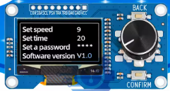
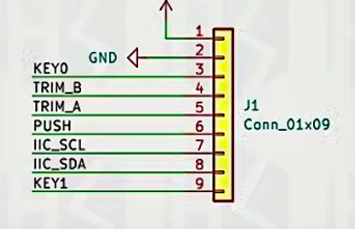
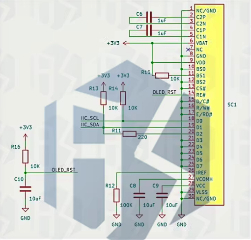
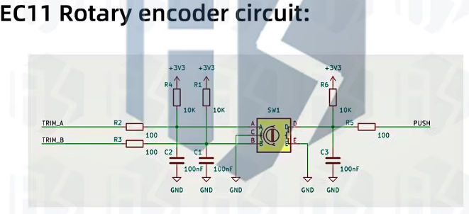
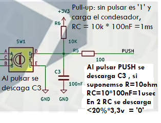

# CL10 - uPython : Display Grafico mono 128x64 SH1106+RE+3sw : 1eros pasos ( no GUI) - PyR 2024_25 CMM BML



Forma parte de la serie '**Workshop about Python and micropython with Pico W in CMM Benito**' Martin Madrid.

Esta clase es más el reflejo de una investigación que un resultado cerrado.

<u>Importante : este estudio **usara librerías básicas** y no librerías GUI</u> como   [nano-gui widget library](https://github.com/peterhinch/micropython-nano-gui), (que incluyen este modelo de display entre los que son capaces de manejar) . El estudio de librerías con GUI se queda para otra clase

## Clase 10 - Indice - xx minutos

- Info previa: Tutoriales, Librerías, Conexionado y Programas que vamos a seguir

- Estudio del SH1106 + RE + 3pulsadores con Pico
  
  - Antes de comprar
  
  - Plantearse objetivos iniciales
    
    - Display : clonar todos los BHWT de ssd1306
    
    - RE : funcionamiento básico de Re con libreria
    
    - Pulsadores : probar
    
    - Letras con tamaños y fuentes disntintas
  
  - Estudio del display con BHWT
  
  - Estudio de RE
  
  - Check de Pulsadores
  
  - Letras con tamaños distintos

## Info. previa : Tutoriales, Librerias, Conexionado y Programas que vamos a seguir

### Link a aliexpres para compra

[SH1106 1.3 pulgadas monocromo I2c](https://es.aliexpress.com/item/1005007728845587.html?spm=a2g0o.order_list.order_list_main.23.1f16194dbIkIVd&gatewayAdapt=glo2esp)

### Tutoriales resumen

**En realidad me he seguido a mi mismo adaptando mi  clase del SSD1306**

Algunos tutos:

El mejor que he encontrado , pero es para ESP32 aunque creo que el codigo deberia valer en su mayor parte 

[011 - MicroPython TechNotes: 1.3 OLED Display | TechToTinker](https://techtotinker.com/2021/02/10/011-micropython-technotes-1-3-oled-display/)

Otros con l aPico

No esta mal : [Using various SSD1306 and SH1106 128x64 OLED displays on a RaspberryPi Pico with micropython - YouTube](https://youtu.be/3TYohlerwaY?si=TxRBgxzFvRkL3fF4)

No es gran cosa : [Raspberry Pi Pico/MicroPython exercise using SH1106 I2C OLED](https://coxxect.blogspot.com/2022/08/raspberry-pi-picomicropython-exercise.html), usa un aversion antigua de la libreria. SIEMPRE ir a buscar al origen las librerias si es posible

### Librería resumen

Parece ser la unica que hay , junto la la de  [nano-gui widget library](https://github.com/peterhinch/micropython-nano-gui)

[GitHub - robert-hh/SH1106: MicroPython driver for the SH1106 OLED controller](https://github.com/robert-hh/SH1106)

Copyright (c) :

- 2016 Radomir Dopieralski (@deshipu),

- 2017-2021 Robert Hammelrath (@robert-hh)

- 2021 Tim Weber (@scy)

----

### Conexiones - Configuración : i2c4_5



* <u>Alimentación</u>

    VCC -> +3,3volt  de la pico 

    GNN -> GND de la Pico

- <u>Display SH1106 I2C</u>

    I2C en GPIO 4&5 = SDA0 & SCL0 a 400khz

El circuito se muestra abajo:

* Tiene un reset por RC

* El I2c va con pull-ups de 10K



- <u>Rotary encoder</u>

De nuevo va con pull -ups y además incluye un circuito RC para alisar los rebotes



    TRA en **GPIO16**

    TRB en **GPIO 17**

Nota : si al probar con la libreria de RE un programa por ejemplo de numero que se incrementa, estos se decrementan ==> hay que cambiar el orden de las conexiones

- <u>3 switchs </u>
  
  No hay información del circuito de los pulsadores  Confirm y Back, pero hay que suponer que incluyen circuitos de pull-ups y de anti-rebotes similares al del pulsador Push
  
  Confirm en GPIO18
  
  Back en GPIO19
  
  Push ( del Rotary encoder) en GPIO20

```
CONFIRM = 18
BACK = 19
PUSH = 20
confPul = Pin(CONFIRM, Pin.IN) # pull up por circuito
backPul = Pin(BACK, Pin.IN) # pull up por circuito
pushPul = Pin(PUSH, Pin.IN) # pull up por circuito
```

### Tabla resumen de programas

| Programa - en uPython                      | Configuración HW                                 | Objetivo del basic HW test                                         |
| ------------------------------------------ | ------------------------------------------------ | ------------------------------------------------------------------ |
| [Rbhwt_I2Cscan.py](Rbhwt_I2Cscan.py)       | I2C en GPIO 4&5 = SDA0 & SCL0 a 400khz := i2c4_5 | Check de que el bus I2c esta ok, la dirección debe ser la 60, 0x3c |
| [Rbhwt_sh1106_1_0.py](Rbhwt_sh1106_1_0.py) | i2c4_5                                           | 1er test: muestra un texto y un cuadrado                           |
|                                            |                                                  |                                                                    |
|                                            |                                                  |                                                                    |
|                                            |                                                  |                                                                    |

### Recomendaciones de estudio despues de la clase

Tutoriales ya indicados

## Estudio de SH1106+RE+3sw

### Antes de comprar

#### Para que

Cuando compramos HW nuevo en robotica hay que preguntarse ¿para que?, porque a veces nos puede mas el deseo que la realidad del tiempo de que disponemos. De todas forma los componente no suelen ser caros, asi que el no comprar debe estar motiva mas en que no nos cuadre en lo que querremos experimentar o estudiar en un futuro cercano.

**Caso SH1106 =>**

1. Estudiar el display gráfico más sencillo posible

2. las 1.3 pulgadas lo hacen mas útil que el SSD1306 (que es muy popular, pero demasiado pequeño) para incorporar a proyectos en los que queramos tener gráficos o logos etc.

#### Comprobar la disponibilidad de librerías y Tutoriales

Ver arriba: **conclusión hay suficientes librerías y estan bien documentadas**

### Plantearse objetivos iniciales

Hay 3 tipos de hw a considerar luego habrá 3 objetivos 1  x cada hw. Adicionalmente con el display exploraremos mas tipos de letras:

1. Display : clonar todos los BHWT de ssd1306

2. RE : funcionamiento básico de Re con libreria

3. Pulsadores : probar

4. Display objetivo adicional : Letras con tamaños y fuentes distintas

### Estudio del display con BHWT

#### 1.Test del I2c => el uC 've' el display

[Rbhwt_I2Cscan.py](Rbhwt_I2Cscan.py)

Con un montaje Hw nuevo conviene siempre empezar comprobando que lo básico funciona. En el caso del display lo que ha de funcionar es el bus I2C es decir que el microcontrolador ***vea*** el display.

El programa de test I2c lo hemos usado más de una vez asi que hay poco que comentar. Veamos el resultado

```
uPython version: v1.25.0-preview.73.g406bccc75 on 2024-12-03 (GNU 13.2.0 MinSizeRel) 
uC: Raspberry Pi Pico2 with RP2350 - Key other HW: I2C en GPIO 4&5 = SDA0 & SCL0 400khz
Program: Test HW basico Scan bus i2c - Version: 1.0
Key Library: Nothing
I2C(0, freq=400000, scl=5, sda=4, timeout=50000)
Scanning I2C bus.
1 devices found.
Decimal address: 60 , Hex address:  0x3c
```

#### 2.Test básico SH1106

El objetivo es tener un programa que muestre en el display un texto y una figura geométrica para estar seguros, no solo de que el bus I2C del display funciona, sino que funciona el propio display.

Veamos como se inicializa el display , como se le ordena la escritura de textos y el dibujo del cuadrado

```
    # 1- Creacion del objeto display
    display = sh1106.SH1106_I2C(WIDTH,
                                HEIGHT,
                                i2c,
                                res = None,
                                addr = 0x3c,
                                rotate = 0) # valores 0, 90, 180, 270
    # 2 inicializacion
    display.sleep(False)
    display.fill(0)
    # 3. escribir text
    display.text('Test JCSP 07mr25', 0, 0, 1)
    # 4. dibujar cuadrado
    display.rect(WIDTH//4 - 10, HEIGHT//2 - 8, 20, 16, 1) # x0, y0, size hor, size vert , color
    # 5 mostrar los ultimos cambios
    display.show()
```

1) En la creación del objeto se pasan los parámetros de:
- anchura y altura del display, 

- el objeto bus i2c recién creado, 

- que el display usado no tiene pin de reset ( ver al final información sobre este tema avanzado)

- la dirección i2c (cuidado si el bus se comparte) 

- la rotación a 0º. Las rotaciones a 90º y 270º son problemáticas. mejor usar el display en apaisado
2. Inicialización
   
   sleep a False activa el display
   
   fill(0) : es decirle al display que llene todo el display del color etiquetado como '0' es decir no color
   
   fill(1) indicaría todo el display en blanco

3. Escribir texto
   
   las coordenadas se cuentan desde la esquina superior izquierda como 0,0
   
   El color 1, corresponde a 'iluminar led' = blanco

4. Dibujar cuadrado
   
   Los parámetros para dibujar cuadrado son x0, y0, size hor, size vert , color

5. Mostrar los últimos cambios
   
   El display al estar basado en frame buffer, no ejecuta los cambios directamente, sino que  tiene una memoria copia de la pantalla, que es donde se hacen los cambios y con show() se vuelcan


### Estudio de RE

### Check de Pulsadores

### Letras con tamaños distintos

------

## Avanzado - Circuitos RC para evitar rebotes



https://www.eejournal.com/article/ultimate-guide-to-switch-debounce-part-2/

Una vez la alimentación estabilizada, el voltaje del condensador esta en 3,3volt . Una vez se pulsa el pulsador se activa el RC de bajada es = 100 ohm * 100nF = 10 us =>> a los 10usec el voltaje en condensador baja al 37% de Vcc = 1,21 que no es aun un '0' --> check

Según el articulo los picos son de 1.5us de media y con máximo de 6.6 us, por los que los filtraría 

## Preguntas sobre la Clase 9 - 10 minutos

Sección para que los alumnos pregunten sus dudas durante la clase

---

TO DO : Estudiar circuitos RC para evitar rebotes con un prototipo 
